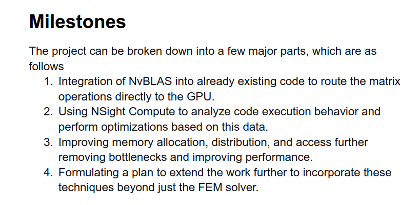
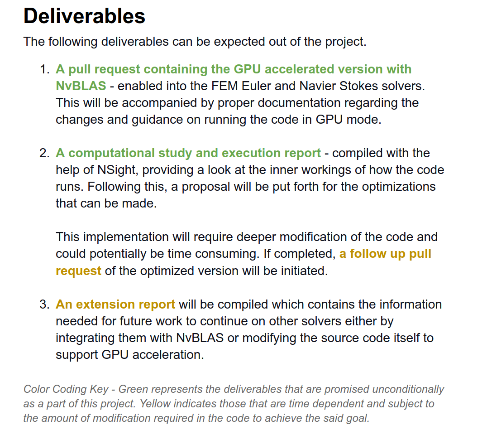
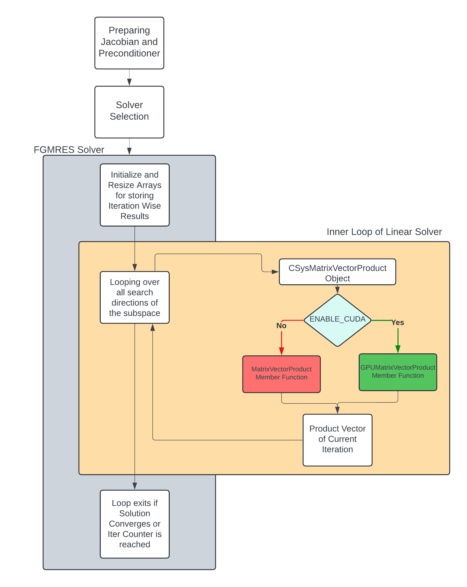
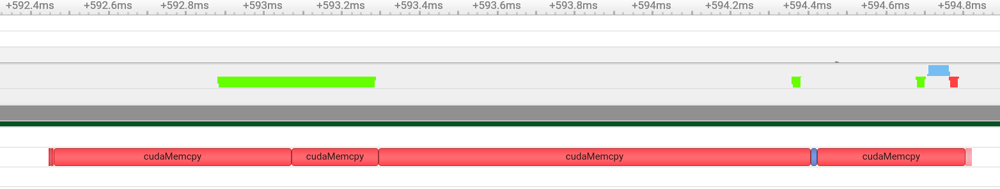
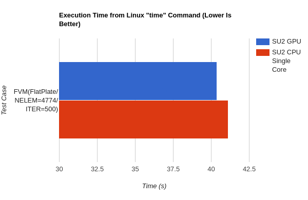
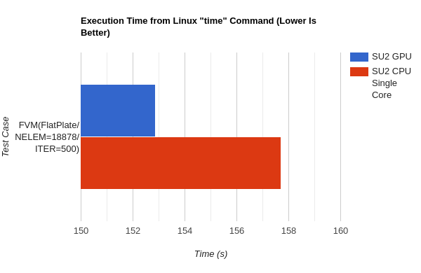
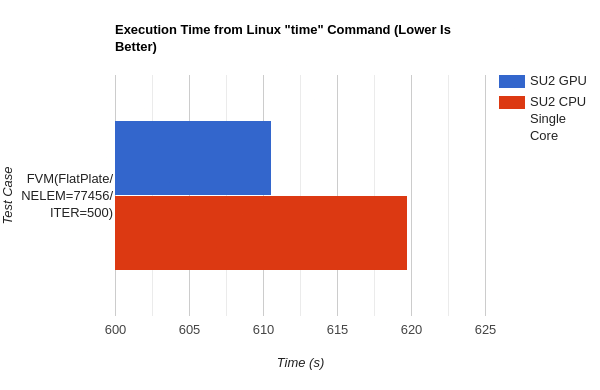
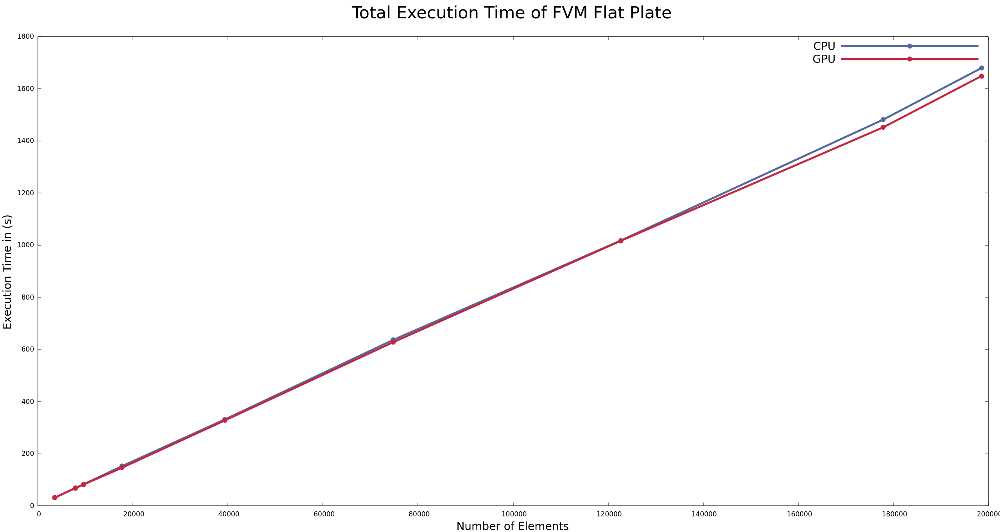
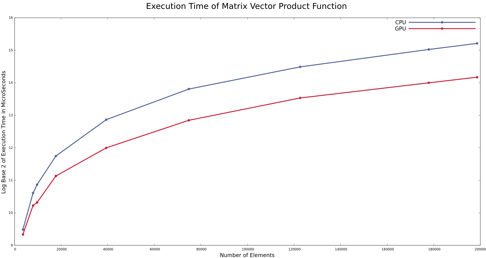
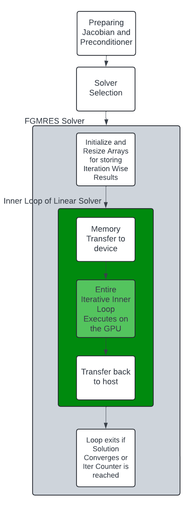

# Google Summer of Code '24 Project - Feasibility of GPU Acceleration in SU2

This code repository contains a version of the SU2 codebase that has CUDA support enabled for offloading particular linear algebra options to the GPU. The current implementations show promise for increased performance with further optimizations and changes. We are also currently working in a new research direction as will be outlined further below.

## Compiling and Running the Code

### Compiling
Currently two modifications exist in the code
- NVBLAS Integration which intercepts calls for the Space Integration in the DG Solver - not very useful
- Acceleration of program wide Matrix Vector Product by outsourcing to a CUDA Kernel

Both can be enabled by giving meson the following option during compilation
```
-Denable-cuda=true
```

You will also need to specify the environment variable CUDA_PATH with the location of the installed CUDA Folder - usually found in the /usr/local directory

A script has been provided which allows you to input your specific paths and use to compile. **We recommend not using MPI currently** as splitting up chunks of the domain will cause issues with predefined memory transfer (that's not good, I know, I'll fix it)

To run the script just go 
```
bash build_SU2.sh
```
A barebones template NVBLAS config file has also been provided for reference.

### Usage

To start the use of the GPU in any simulation involving the FGMRES solver. Just set the following keyword in the config file to YES

```
ENABLE_CUDA=YES
```

Error handling is done by an Error Check Wrapper and should provide exit codes at the file and line of the anomaly.

### Benchmarking

To benchmark the individual member functions, the following sections of code in the CMatrixVectorProduct.hpp file have to be uncommented.

```

   std::ofstream serial;

   auto start = std::chrono::high_resolution_clock::now(); 
.
.
.

   auto stop = std::chrono::high_resolution_clock::now();
   auto duration = std::chrono::duration_cast<std::chrono::microseconds>(stop - start);

   double time = duration.count();

   serial.open("MVP_Exec_Time.txt", std::ios::app);
   serial << time << "\n";
   serial.close();

```

This will create a file named MVP_Exec_Time.txt which contains the execution time in microseconds. Always remove or delete the file before starting another run or else the new times will get appended onto it.

Also it is recommended to disable GPU Error Check functions before starting as this may cause excessive overhead in execution. These may be removed from the GPU_lin_alg.cu and CSysMatrix.cpp files.

## Initial Proposal and Deliverables

This section outlines the original plan of the project and the changes that were made throughout the course of its duration.

Initially we decided to approach the addition of GPU functionality to SU2 using the NVBLAS framework. Since the FEM solver used level 3 BLAS calls which can be intercepted by the NVBLAS library directly and routed to the GPU if it is deemed that the  particular call would execute faster on the GPU. 

Our proposed milestones were the implementation and further optimization of this approach.



After creating an NVBLAS enabled version of the code, our investigation revealed that the BLAS calls are made only during the Space Integration subroutine that would not give us a sizeable speedup in the code. 

The major chunk of linear algebra operations happens while using an implicit time scheme that involves solving a matrix system. This Time Integration subroutine is also one of the most computationally intensive sections of the code.

## Pivoting to a more Practical Approach

This is the reason that the NVBLAS integration did not offer a path of execution that could provide considerable speed up to our execution time. Therefore, we chose to switch our focus to a more impactful implementation by directly working on the linear solvers that handle the Matrix operations in the Time Integration subroutine.

This would

- Offer a bigger overall boost to the performance of the code as we would be targetting a critical area 
- Automatically extend this endeavor to other solvers, not only fulfilling the fourth milestone, but also being a wide-reaching solution.

**We took this decision keeping in mind that the Summer of Code program is not geared towards only fulfilling deliverables and keeping in line with timelines. But that it serves the overall goal of writing more useful code that has a bigger effect.**



- An NVBLAS integrated version was successfully created by linking the necessary library into the code
- Acceleration of the program was made possible by outsourcing Matrix-Vector Products usinga a CUDA kernel
- This file serves as the execution + extension report that is mentioned above. NSight tools were used to profile the code as initially proposed 
  
## Current Implementation

For the working problem, we have focused on two aspects of the solving algorithm

- The FGMRES solver that heavily relies on Matrix-Vector Products
- Owing to the above point, we modify the matrix vector product class and functions

A flowchart of the current algorithm that we use is presented below. 



The GPUMatrixVectorProduct Member Function belongs to the CSysMatrix Class

- The function makes cudaMalloc and cudaMemcpy API calls to transfer the participating matrix and vector data to the GPU
- The GPUMatrixVectorProductAdd kernel is launched which multiplies the block matrix with the vector using CUDA
- The data of the Product Vector is transferred back to the CPU and the device pointers are freed

## Code Profiling

Using NSight Systems, we can get the analysis of the implementation. This profiling was done for the flat plate case in the FVM NSS Solver with the number of elements being 4096.



As expected, the memory transfer between the host and device comprises of the main downtime in this implementation (2.315 ms per call). The Kernel launch itself is only 0.014 ms long. 

## Results

All benchmarks are done without GPU error checking as it adds a considerable overhead to the entire operation.

The following results were done with increasing mesh density for the flatplate case.


 
 

It is promising to see that even with a preliminary algorithm the GPU implementation manages to break out ahead of the single core CPU one. Comparisons between the total execution time for a larger number of cases is shown as below



Even with increasing problem size the GPU implementation scales well enough to stay ahead of the CPU one although marginally.

The time taken to execute only the CPU and GPU member functions were measured. In this case, the GPU implementation is over twice as fast as its CPU counterpart. The following log scale graph is representative of that



The GPU member function consistently outperforms the CPU one by a considerable margin.

## Moving Forward

If the number of the repeated memory transfers can be reduced then we can gain a considerable boost as cudaMemcpy is invoked per call. The individual performance of the member function clearly shows an exploitable edge when it comes to the linear algebra functions.

Our current direction happens to be to cut down on the transfers by porting not only each iteration of the FGMRES inner loop but the entire loop itself to the GPU. This allows us for only one single memory transfer per iteration.

The algorithm would be changed approximately to what is represented below.



This should alleviate the issue of expensive memory transfers to the device to a sizeable extent, firther providing a performance uplift. **This line of work will be pursued even after the finishing of the GSoC Program**

## To Do List

- Make sure that error handling is implemented properly
- Work on removing the unnecessary warnings that are currently appearing during compilation
- Port the inner loop to the GPU
- Open a PR as soons as 1 and 2 are finished


# STANDARD README STARTS HERE

<p align="center">

</p>


# SU2 (ver. 8.0.1 "Harrier"): The Open-Source CFD Code

Computational analysis tools have revolutionized the way we design engineering systems, but most established codes are proprietary, unavailable, or prohibitively expensive for many users. The SU2 team is changing this, making multiphysics analysis and design optimization freely available as open-source software and involving everyone in its creation and development.

For an overview of the technical details in SU2, please see the following AIAA Journal article:

"SU2: An open-source suite for multiphysics simulation and design," AIAA Journal, 54(3):828-846, 2016. <http://arc.aiaa.org/doi/10.2514/1.J053813>

Please note that this project is released with a [Contributor Code of Conduct](CODE_OF_CONDUCT.md). By participating in this project you agree to abide by its terms.

Continuous Integration:<br/>
[](https://github.com/su2code/SU2/actions)
[](https://github.com/su2code/SU2/actions)

Code Quality:<br/>
[](https://www.codefactor.io/repository/github/su2code/su2)

# SU2 Introduction

SU2 is a suite of open-source software tools written in C++ for the numerical solution of partial differential equations (PDE) and performing PDE constrained optimization.

The primary applications are computational fluid dynamics and aerodynamic shape optimization, but has been extended to treat more general equations such as electrodynamics and chemically reacting flows.

You will find more information and the latest news in:

- SU2 Home Page: <https://su2code.github.io>
- GitHub repository: <https://github.com/su2code>
- CFD Online: <http://www.cfd-online.com/Forums/su2/>
- Twitter: <https://twitter.com/su2code>
- Facebook: <https://www.facebook.com/su2code>

# SU2 Installation

## Precompiled binaries for Linux, MacOS, Windows

You can find precompiled binaries of the latest version on our [download page](https://su2code.github.io/download.html) or under [releases](https://github.com/su2code/SU2/releases).

## Build SU2

The build system of SU2 is based on a combination of [meson](http://mesonbuild.com/) (as the front-end) and [ninja](https://ninja-build.org/) (as the back-end). Meson is an open source build system meant to be both extremely fast, and, even more importantly, as user friendly as possible. Ninja is a small low-level build system with a focus on speed.

Short summary of the minimal requirements:

- C/C++ compiler
- Python 3

**Note:** all other necessary build tools and dependencies are shipped with the source code or are downloaded automatically.

If you have these tools installed, you can create a configuration using the `meson.py` found in the root source code folder:

```
./meson.py build
```

Use `ninja` to compile and install the code

```
./ninja -C build install
```

For more information on how to install and build SU2 on Linux, MacOS or Windows, have a look at the [documentation](https://su2code.github.io/docs_v7/).

## SU2 Path setup

When installation is complete, please be sure to add the `$SU2_HOME` and `$SU2_RUN` environment variables, and update your `$PATH` with `$SU2_RUN`.

For example, add these lines to your `.bashrc` file:

```
export SU2_RUN="your_prefix/bin"
export SU2_HOME="/path/to/SU2vX.X.X/"
export PATH=$PATH:$SU2_RUN
export PYTHONPATH=$SU2_RUN:$PYTHONPATH
```

`$SU2_RUN` should point to the folder where all binaries and python scripts were installed. This is the prefix you set with the --prefix option to meson. Note that the bin/ directory is automatically added to your prefix path.

`$SU2_HOME` should point to the root directory of the source code distribution, i.e., `/path/to/SU2vX.X.X/`.

Thanks for building, and happy optimizing!

- The SU2 Development Team

# SU2 Developers

We follow the popular "GitFlow" branching model for scalable development. In the SU2 repository, the master branch represents the latest stable major or minor release (7.0, 6.2.0, etc.), it should only be modified during version releases. Work that is staged for release is put into the develop branch via Pull Requests on GitHub from various "feature" branches where folks do their day-to-day work on the code. At release time, the work that has been merged into the develop branch is pushed to the master branch and tagged as a release.

SU2 is being developed by individuals and organized teams all around the world.

A list of current contributors can be found in the AUTHORS.md file.

## Documentation

Code documentation can be generated by calling doxygen from the root of the project, then open Docs/html/index.html in a browser to consult the documentation.
