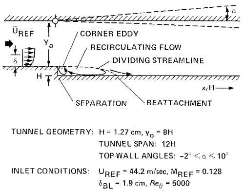
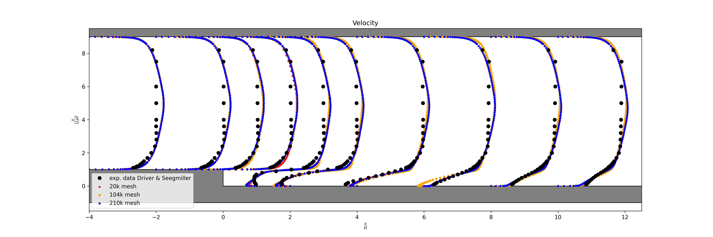
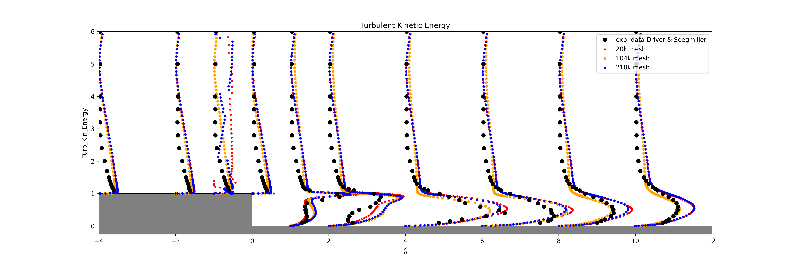
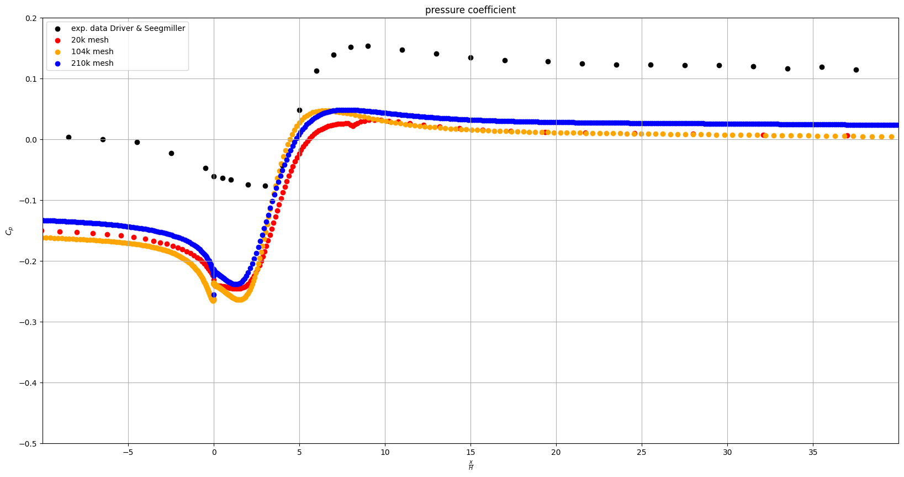

# 2D Backward Facing Step Validation Case

| Solver | Version |
| --- | --- |
| INC_RANS |  8.1.0 "Harrier"  |

---

The 2D Backward-Facing Step (BFS) is a classical benchmark case for validating turbulence models. In this configuration, a fully developed turbulent boundary layer encounters a sudden back step, leading to flow separation and recirculation zones downstream. The experimental data provided by Driver and Seegmiller serves as the reference for this validation case.

## Problem Setup

Geometry: The BFS model consists of a channel with a sudden expansion due to a step. The step height (H) is the primary geometric parameter and in this case it is set to $0.0127m$. This corresponds to a Reynolds number of approximately 36,000 based on step height H. Geometry of the testcase is shown in the following image.

The simulation is performed with the following boundary conditions:

- Inlet: A specified velocity profile representing the turbulent boundary layer.
- Walls: No-slip conditions on both the upper and lower walls.
- Outlet: pressure outlet condition.

## Mesh Description

To ensure accurate resolution of the flow features, particularly in the recirculation region downstream of the step, a sequence of structured nested grids is used. These grids are designed to effectively capture adverse pressure gradients and flow separation. The approximate mesh sizes are:

- L1 "coarse" - 20k quadrilaterals
- L2 "medium" - 104k quadrilaterals
- L3 "fine" - 210k quadrilaterals

## Results

The SST turbulence model demonstrates excellent agreement with experimental results for velocity and turbulent kinetic energy. However, the pressure coefficient appears to be slightly under-predicted, as seen in the comparison figures below.

