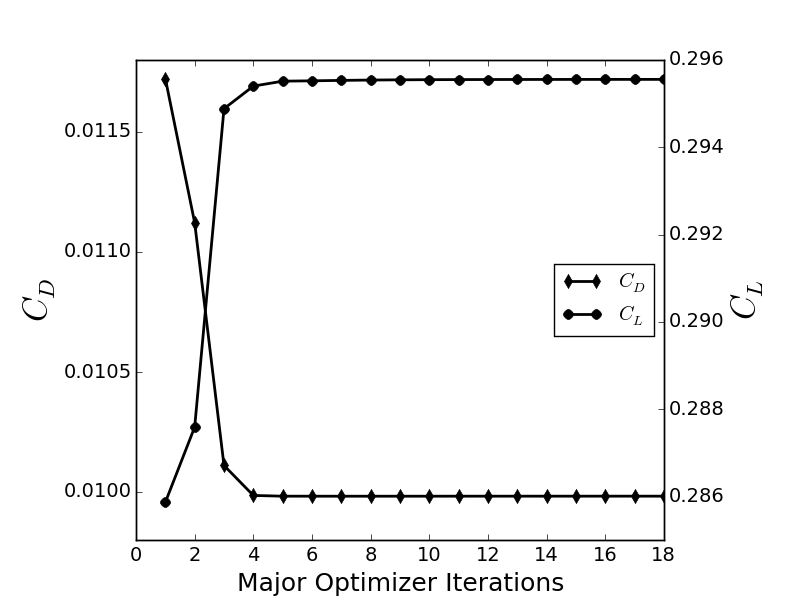
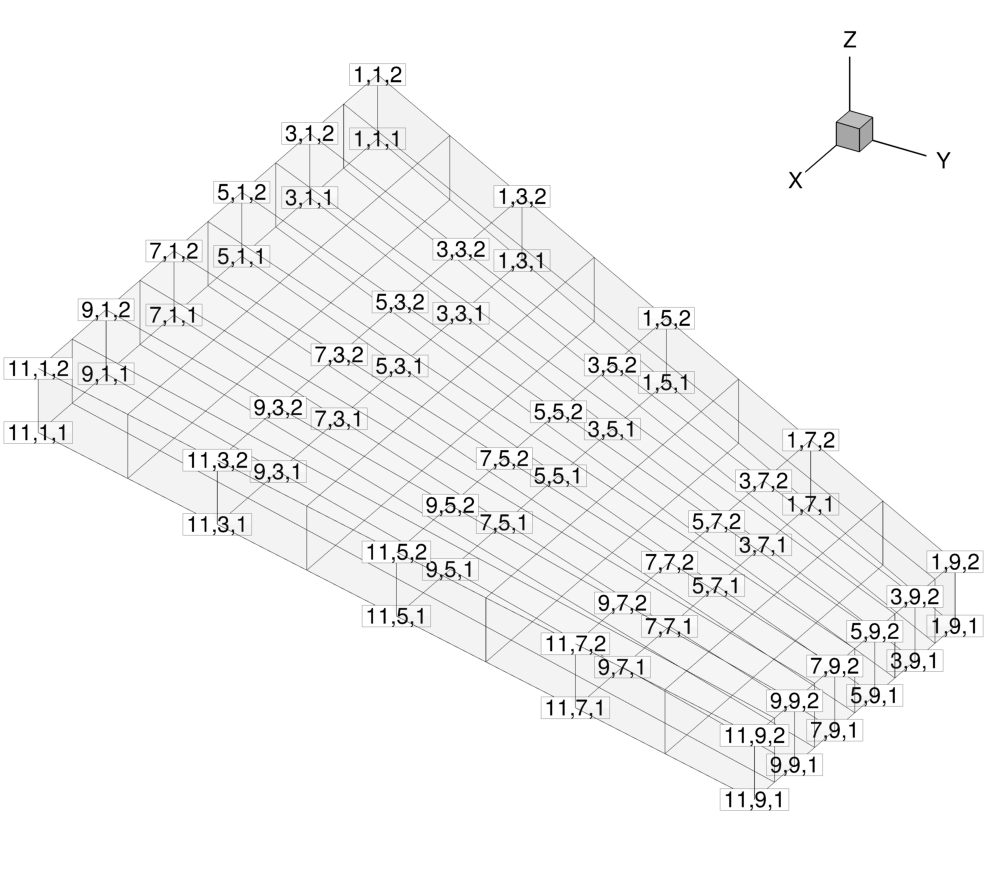
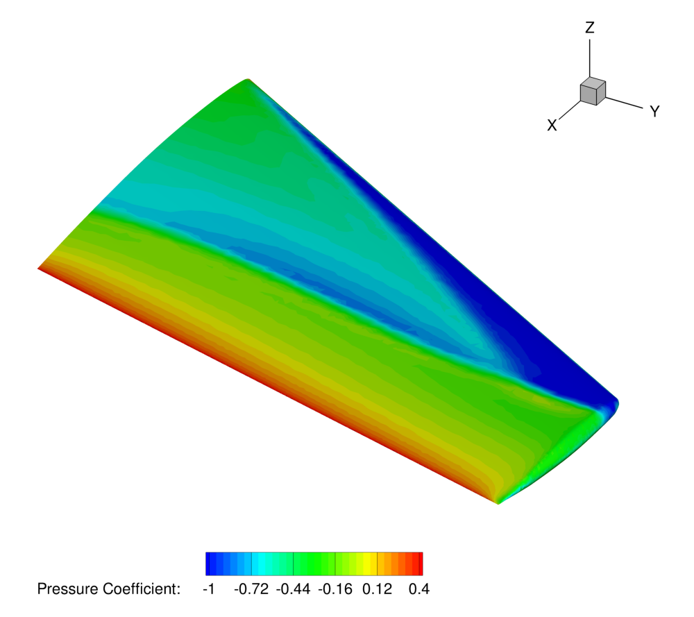

Constrained Optimal Shape Design of a Fixed Wing
====



## Goals

Upon completing this tutorial, the user will be familiar with performing an optimal shape design of a 3D geometry. The initial geometry chosen for the tutorial is a ONERA M6 fixed wing at transonic speed in inviscid fluid. The following SU2 tools will be showcased in this tutorial:
- **SU2_CFD** - performs the direct and the adjoint flow simulations.
- **SU2_DOT** - projects the adjoint surface sensitivities into the design space to obtain the gradient.
- **SU2_DEF** - deforms the geometry and mesh with changes in the design variables during the shape optimization process.
- **SU2_GEO** - evaluates the thickness of the specified wing sections and their gradients.
- **shape_optimization.py** - automates the entire shape design process by executing the SU2 tools and optimizer.

## Resources

The resources for this tutorial can be found in the Tutorials/Constrained_Optimal_Shape_Design directory. You will need the configuration file (inv_ONERAM6_adv.cfg) and the mesh file (mesh_ONERAM6_inv_FFD.su2). Note that the mesh file already contains information about the definition of the Free Form Deformation (FFD) used for the definition of 3D design variables, but we will discuss how this is created below. **The files for this tutorial have been updated since SU2 v4.1, so it is recommended that you check out the current master version of the source and test case repositories.**

## Tutorial

The following tutorial will walk you through the steps required when performing 3D shape design using SU2, including the FFD tools. It is assumed that you have already obtained and compiled SU2_CFD, SU2_DOT, and SU2_DEF. The design loop is driven by the shape_optimization.py script, and thus Python along with the NumPy and SciPy Python modules are required for this tutorial. If you have yet to complete these requirements, please see the Download and Installation pages.

### Problem Setup

The goal of this wing design problem is to minimize the coefficient of drag by changing the shape while imposing lift and wing section thickness constraints. As design variables, we will use a free-form deformation approach. In this approach, a lattice of control points making up a bounding box are placed around the geometry, and the movement of these control points smoothly deforms the surface shape of the geometry inside. We begin with a 3D fixed-wing geometry (initially the ONERA M6) at transonic speed in air (inviscid). The flow conditions are the same as for the previous [[Inviscid ONERA M6]] tutorial.


Figure (1): View of the initial surface computational mesh.

### Mesh Description

The mesh consists of a far-field boundary divided in three surfaces (XNORMAL_FACES, ZNORMAL_FACES, YNORMAL_FACES), an Euler wall (flow tangency) divided into three surfaces (UPPER_SIDE, LOWER_SIDE, TIP), and a symmetry plane (SYMMETRY_FACE). The baseline mesh is the same as for the previous [[Inviscid ONERA M6]] tutorial. The surface mesh can be seen in Figure (1).


Figure (2): View of the initial FFD box around the ONERA M6 wing, including the control points (spheres).

### Setting up a Free-Form Deformation Box
 
The mesh file that is provided for this test case already contains the FFD information. However, if you are interested in repeating this process for your own design cases, it is necessary to calculate the position of the control points and the parametric coordinates. The description below describes how to set up FFD boxes for deformation.

The design variables are defined using the FFD methodology. We will customize a set a options that specifically target FFD box creation:
 
```
% -------------------- FREE-FORM DEFORMATION PARAMETERS -----------------------%
%
% Tolerance of the Free-Form Deformation point inversion
FFD_TOLERANCE= 1E-10
%
% Maximum number of iterations in the Free-Form Deformation point inversion
FFD_ITERATIONS= 500
%
% FFD box definition: 3D case (FFD_BoxTag, X1, Y1, Z1, X2, Y2, Z2, X3, Y3, Z3, X4, Y4, Z4,
%                              X5, Y5, Z5, X6, Y6, Z6, X7, Y7, Z7, X8, Y8, Z8)
%                     2D case (FFD_BoxTag, X1, Y1, 0.0, X2, Y2, 0.0, X3, Y3, 0.0, X4, Y4, 0.0,
%                              0.0, 0.0, 0.0, 0.0, 0.0, 0.0, 0.0, 0.0, 0.0, 0.0, 0.0, 0.0)
FFD_DEFINITION= (WING, -0.0403, 0, -0.04836, 0.8463,0, -0.04836, 1.209, 1.2896, -0.04836, 0.6851, 1.2896, -0.04836, -0.0403, 0, 0.04836, 0.8463, 0, 0.04836, 1.209, 1.2896, 0.04836, 0.6851, 1.2896, 0.04836)
%
% FFD box degree: 3D case (x_degree, y_degree, z_degree)
%                 2D case (x_degree, y_degree, 0)
FFD_DEGREE= (10, 8, 1)
%
% Surface continuity at the intersection with the FFD (1ST_DERIVATIVE, 2ND_DERIVATIVE)
FFD_CONTINUITY= 2ND_DERIVATIVE
```

As the current implementation requires each FFD box to be a quadrilaterally-faced hexahedron (6 faces, 12 edges, 8 vertices), we can simply specify the the 8 corner points of the box and the polynomial degree we would like to represent along each coordinate direction (x,y,z) in order to create the complete lattice of control points. It is convenient to think of the FFD box as a small structured mesh block with (i,j,k) indices for the control points, and note that the number of control points in each direction is the specified polynomial degree plus one. 

In the example above, we are creating a box with control point dimensions 11, 9, and 2 in the x-, y-, and z-directions, respectively, for a total of 198 available control points. In the FFD_DEFINITION option, we give a name to the box ("WING"), and then list out the x, y, and z coordinates of each corner point. The order is important, and you can use the example above to match the convention. The degree is then specified in the FFD_DEGREE option. A view of the box with the control points numbered is in Figure (3). Note that the numbering in the figure is 1-based just for visualization, but within SU2, the control points have 0-based indexing. For example, the (1,1,1) control point in the figure is control point (0,0,0) within SU2. This is critical for specifying the design variables in the config file.


Figure (3): View of the control point identifying indices, which increase in value along the positive coordinate directions. Note that the numbering here is 1-based just for visualization, but within SU2, the control points have 0-based indexing.

Lastly, the FFD capabilities within SU2 also feature a nifty technique to automatically ensure that you do not obtain any jumps or kinks in your deformed geometry. You can control this by requesting continuity in the 1st or 2nd derivative of the surface with the FFD_CONTINUITY option. In short, the code will automatically detect when a face of the FFD box intersects the geometry, and it will hold fixed the control points on that face (1ST_DERIVATIVE) or the points on the face as well as one slice of adjacent control points (2ND_DERIVATIVE). **Note that these control points will be held fixed during design cycles even if you specify them in your design variable list**.

Now that the FFD box has been defined using the options, follow these steps at a terminal command line to generate a **new** mesh that contains the FFD box:
 1. Move to the directory containing the config file (inv_ONERAM6_adv.cfg) and the mesh file (mesh_ONERAM6_inv_FFD.su2). Make sure that the SU2 tools were compiled, installed, and that their install location was added to your path.
 2. Check that DV_KIND= FFD_SETTING in the configuration file. 
 3. Execute SU2_DEF by entering "SU2_DEF inv_ONERAM6_adv.cfg" at the command line. This can also be executed in parallel.
 4. After completing the FFD mapping process, a mesh file named "mesh_out.su2" (by default) is now in the directory. Rename that file to "mesh_ONERAM6_inv_FFD.su2". Note that this new mesh file contains all the details of the FFD method.

With this preprocessing, the position of the control points and the parametric coordinates have been calculated. The preprocessing only needs to be performed once, and afterward, the new (x,y,z) coordinates of the geometry surface due to control point displacements can be quickly evaluated from the mapping. This information is stored in a native format at the bottom of the SU2 mesh file. You will use this new mesh for the design process. If you find that your particular case stalls or throws errors during the creation of the box, the FFD_TOLERANCE and FFD_ITERATIONS parameters can be adjusted to achieve convergence of the algorithm.

### Defining the Optimization Problem

Several of the key configuration file options are highlighted here. Since we are using the same flow problem from the previous tutorials, we will focus on the new design parameter options:
```
% --------------------- OPTIMAL SHAPE DESIGN DEFINITION -----------------------%
%
% Optimization objective function with scaling factor
% ex= Objective * Scale
OPT_OBJECTIVE= DRAG * 0.1
%
% Optimization constraint functions with scaling factors, separated by semicolons
% ex= (Objective = Value ) * Scale, use '>','<','='
OPT_CONSTRAINT= (LIFT > 0.2864) * 0.1; (MAX_THICKNESS_SEC1 > 0.0570) * 0.1; (MAX_THICKNESS_SEC2 > 0.0513) * 0.1; (MAX_THICKNESS_SEC3 > 0.0457) * 0.1; (MAX_THICKNESS_SEC4 > 0.0399) * 0.1; (MAX_THICKNESS_SEC5 > 0.0343) * 0.1
%
% Maximum number of iterations
OPT_ITERATIONS= 100
%
% Requested accuracy
OPT_ACCURACY= 1E-10
%
% Upper bound for each design variable
OPT_BOUND_UPPER= 0.3
%
% Lower bound for each design variable
OPT_BOUND_LOWER= -0.3
%
% Optimization design variables, separated by semicolons
% ex= FFD_CONTROL_POINT ( 7, Scale | Mark. List | FFD_BoxTag, i_Ind, j_Ind, k_Ind, x_Mov, y_Mov, z_Mov )
DEFINITION_DV= ( 7, 1.0 | UPPER_SIDE, LOWER_SIDE, TIP | WING, 0, 1, 0, 0.0, 0.0, 1.0 ); ( 7, 1.0 | UPPER_SIDE, LOWER_SIDE, TIP | WING, 1, 1, 0, 0.0, 0.0, 1.0 ); ...
```

Here, we define the objective function for the optimization as drag with a lift constraint and thickness constraints along 5 sections of the wing. The DEFINITION_DV is the list of design variables. For this problem, we want to minimize the drag by changing the position of the control points of the control box. To do so, we list the set of FFD control points that we would like to use as variables. Each design variable is separated by a semicolon. The first value in the parentheses is the variable type, which is 7 for an FFD control point movement. The second value is the scale of the variable (typically left as 1.0). The name between the vertical bars is the marker tag(s) where the variable deformations will be applied. The final seven values in the parentheses are the particular information about the deformation: identification of the FFD tag, the i, j, and k index of the control point, and the allowed x, y, and z movement direction of the control point. Note that other types of design variables have their own specific input format. For this example, we have a long list of design variables that are not all listed above. You can quickly generate a list of FFD variables in the necessary format using the **set_ffd_design_var.py** script that is shipped with the other Python utilities with the source code.

Lastly, we need to specify where the wing sections are located for applying the thickness constraints. Currently, a maximum of 5 thickness constraints can be applied during design. The thicknesses and their gradients are computed using the SU2_GEO module, and the necessary options are the following:
```
% ----------------------- GEOMETRY EVALUATION PARAMETERS ----------------------%
%
% Geometrical evaluation mode (FUNCTION, GRADIENT)
GEO_MODE= FUNCTION
%
% Marker(s) of the surface where geometrical based func. will be evaluated
GEO_MARKER= ( UPPER_SIDE, LOWER_SIDE, TIP )
%
% Number of airfoil sections
GEO_NUMBER_SECTIONS= 5
%
% Orientation of airfoil sections (X_AXIS, Y_AXIS, Z_AXIS)
GEO_ORIENTATION_SECTIONS= Y_AXIS
%
% Location (coordinate) of the airfoil sections (MinValue, MaxValue)
GEO_LOCATION_SECTIONS= (0.0806, 1.1284)
```
As you can see, we need to specify the names of the markers that make up the geometry of interest, the number of sections, a coordinate axis perpendicular to our slicing planes, and the two endpoints (inclusive). The slices will be evenly distributed between the min and max locations. For the present wing case, we will be making cuts at 5 span locations to check the max thickness of those sections.

### Running SU2

A continuous adjoint methodology for obtaining surface sensitivities is implemented for several equation sets within SU2. After solving the direct flow problem, the adjoint problem is also solved. The adjoint method offers an efficient approach for calculating the gradient of an objective function with respect to a large set of design variables. This leads directly to a gradient-based optimization framework. 

With each design iteration, the direct and adjoint solutions are used to compute the objective function and gradient, and the optimizer drives the shape changes with this information in order to minimize the objective. Each flow constraint requires the solution of an additional adjoint problem to compute its gradient (lift in this case). Three other SU2 tools are used in the design process here: SU2_DOT to compute the gradient from the adjoint surface sensitivities and input design space, SU2_GEO to compute wing section thicknesses and their gradients, and SU2_DEF to deform the computational mesh between design cycles. To run this case, follow these steps at a terminal command line:
 1. Execute the shape optimization script by entering "shape_optimization.py -f inv_ONERAM6_adv.cfg" at the command line, add "-n 12" in case you want to run the optimization in parallel (12 cores). Again, note that Python, NumPy, and SciPy are all required to run the script.
 2. The python script will drive the optimization process by executing flow solutions, adjoint solutions, gradient projection, geometry evaluations, and mesh deformation in order to drive the design toward an optimum. The optimization process will cease when certain tolerances set within the SciPy optimizer are met. Note that is is possible to start the optimization from a pre-converged solution (direct and adjoint problem), in that case the following change should be done in the configuration file: RESTART_SOL= YES.
 3. Solution files containing the flow and surface data will be written for each flow solution and adjoint solution and can be found in the DESIGNS directory that is created. The file named history_project.plt (or history_project.csv for ParaView) will contain the functional values of interest resulting from each evaluation during the optimization. The major iterations and function evaluations for the SLSQP optimizer will be written to the console during execution.

### Results 

The following are representative results for this transonic shape design example with the ONERA M6 geometry as a baseline. We successfully reduce the drag while satisfying the constraints.


Figure (4): Pressure contours showing the typical "lambda" shock on the upper surface of the initial geometry.


Figure (5): Pressure contours on the surface of the final wing design (reduced shocks).


Figure (6): View of the initial (black) and final (blue) FFD control point positions.


Figure (7): Optimization history. The drag is reduced and the lift constraint is easily met.
