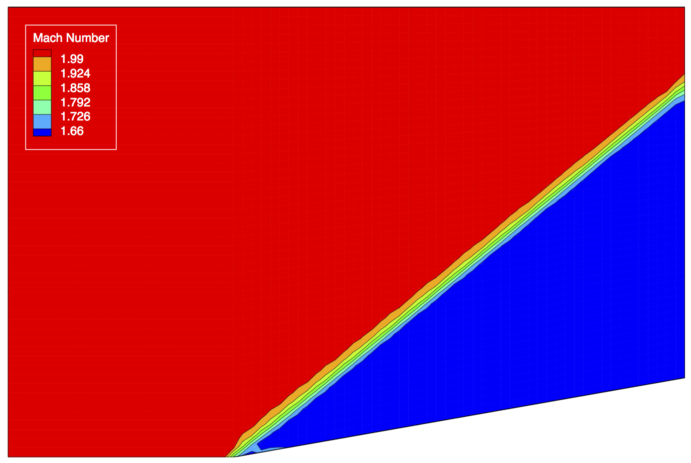
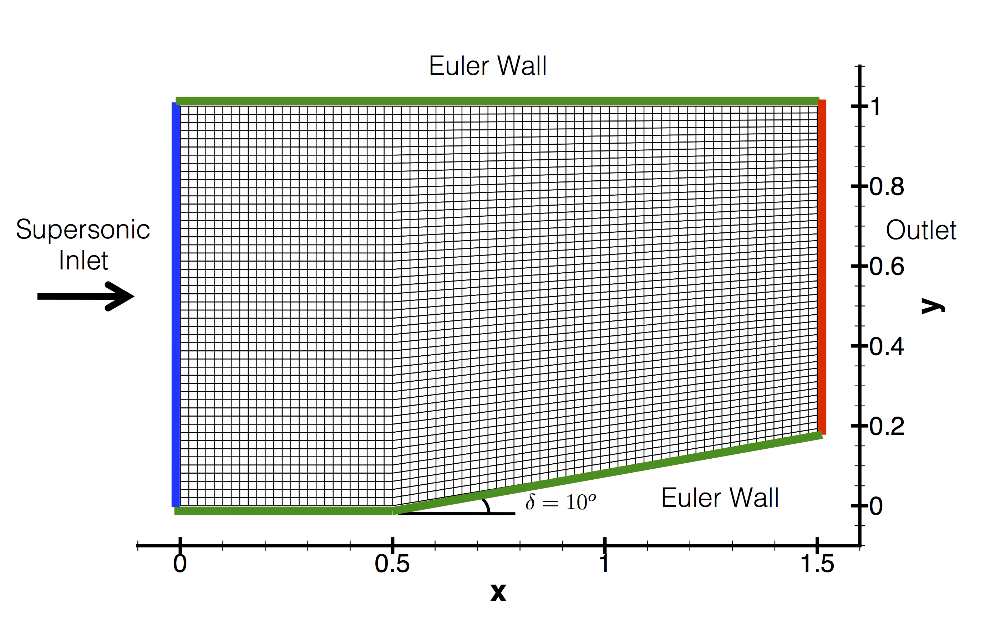
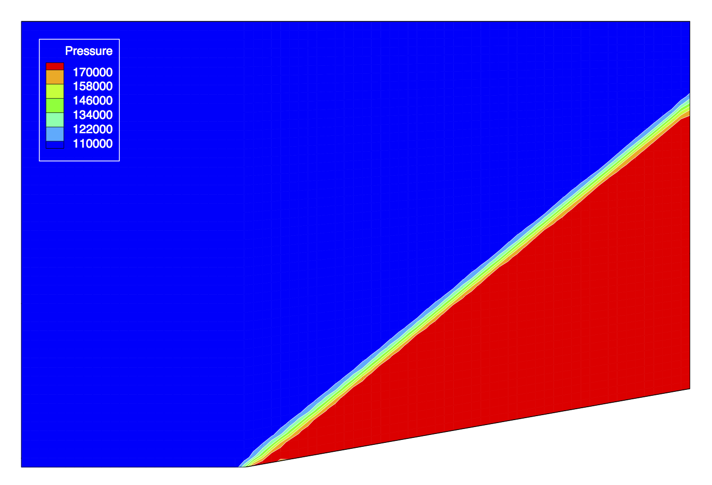

Inviscid Supersonic Wedge
=====



## Goals

Upon completing this tutorial, the user will be familiar with performing a simulation of supersonic, inviscid flow over a 2-D geometry. The specific geometry chosen for the tutorial is a simple wedge. Consequently, the following capabilities of SU2 will be showcased in this tutorial:
- Steady, 2-D Euler equations 
- Multigrid
- HLLC numerical scheme in space
- Euler implicit time integration
- Supersonic Inlet, Outlet, and Euler Wall boundary conditions

The intent of this tutorial is to introduce a simple, inviscid flow problem that will allow users to become familiar with using a CGNS mesh. This will require SU2 to be built with CGNS support (CGNS will be automatically built and linked for you during compilation), and some new options in the configuration file related to CGNS meshes and their conversion will be discussed.

## Resources

The resources for this tutorial can be found in the TestCases/euler/wedge/ directory. You will need the configuration file (inv_wedge_HLLC.cfg) and the mesh file (mesh_wedge_inv.cgns).

## Tutorial

The following tutorial will walk you through the steps required when solving for the supersonic flow past the wedge using SU2. It is assumed you have already obtained and compiled SU2_CFD with CGNS support. If you have yet to complete these requirements, please see the [[Download]] and [[Installation]] pages.

### Background

This example uses a 2-D geometry which features a wedge along the solid lower wall. In supersonic flow, this wedge will create an oblique shock, and its properties can be predicted from the oblique-shock relations for a perfect gas (see your favorite compressible fluids textbook for more information). This is a common test case for CFD codes due to its simplicity along with the ability to verify the code against the oblique-shock relations.

### Problem Setup

This problem will solve for the flow over the wedge with these conditions:
- Freestream Pressure = 100000 Pa
- Freestream Temperature = 300 K
- Freestream Mach number = 2.0
- Angle of attack (AOA) = 0.0 deg

### Mesh Description

The wedge mesh is a structured mesh (75x50) of rectangular elements with a total of 3,750 nodes. The upper and lower wall of the geometry are solid (MARKER_EULER), and the lower wall has a 10 degree wedge starting at x = 0.5. Figure (1) shows the mesh with the boundary markers and flow conditions highlighted.


Figure (1): The computational mesh with boundary conditions highlighted.

For this test case, the inlet marker will be set to a MARKER_SUPERSONIC_INLET boundary condition, while the outlet marker will be set to the MARKER_OUTLET condition. In supersonic flow, all characteristics point into the domain at the entrance (inlet marker), and therefore, all flow quantities can be specified, i.e., no information travels upstream. At the exit, however, all characteristics are outgoing, meaning that no information about the exit conditions is required. Therefore, the outlet marker is set to the outlet boundary condition which, in supersonic flow, simply extrapolates the flow variables from the interior domain to the exit. In practice, a low back pressure is supplied to the MARKER_OUTLET boundary condition in the configuration file, but the propagation of information in this supersonic flow make it unnecessary information.

### Configuration File Options

Several of the key configuration file options for working with CGNS meshes are given here. The latest version of SU2 ships with the source code for the CGNS library, and it will automatically be built and linked during the SU2 compilation process. Here, we will discuss a few options in the wedge configuration file as a practical example for getting your own CGNS mesh files working:
```
% ------------------------- INPUT/OUTPUT INFORMATION --------------------------%
%
% Mesh input file
MESH_FILENAME= mesh_wedge_inv.cgns
%
% Mesh input file format (SU2, CGNS)
MESH_FORMAT= CGNS
```
To use the supplied CGNS mesh, simply enter the filename and make sure that the MESH_FORMAT option is set to CGNS. The output written to the console during this process might look like the following for the supersonic wedge mesh:
```
---------------------- Read Grid File Information -----------------------
Reading the CGNS file: mesh_wedge_inv.cgns.
CGNS file contains 1 database(s).
Database 1, Base: 1 zone(s), cell dimension of 2, physical dimension of 3.
Zone 1, dom-1: 3750 vertices, 3626 cells, 0 boundary vertices.
Reading grid coordinates.
Number of coordinate dimensions is 3.
Loading CoordinateX values into linear partitions.
Loading CoordinateY values into linear partitions.
Loading CoordinateZ values into linear partitions.
Number of connectivity sections is 5.
Loading section QuadElements of element type Quadrilateral.
Loading section inlet of element type Line.
Loading section lower of element type Line.
Loading section outlet of element type Line.
Loading section upper of element type Line.
Successfully closed the CGNS file.

Loading CGNS data into SU2 data structures.
Two dimensional problem.
3626 interior elements.
3750 grid points.
4 surface markers.
49 boundary elements in index 0 (Marker = inlet).
74 boundary elements in index 1 (Marker = lower).
49 boundary elements in index 2 (Marker = outlet).
74 boundary elements in index 3 (Marker = upper).
3626 quadrilaterals.
```
SU2 prints out information on the CGNS mesh including the filename, the number of points, and the number of elements. Another useful piece of information is the listing of the sections within the mesh. These descriptions give the type of elements for the section as well as any name given to it. For instance, when the inlet boundary information is read, SU2 prints "Loading section inlet of element type Line" to the console. This information can be used to verify that your mesh is being read correctly, or to help you remember, or even learn for the first time, the names for each of the boundary markers.

A converter for creating .su2 meshes from CGNS meshes is built directly into SU2_DEF, along with many other facilities for manipulating and deforming grids (e.g., scaling, translating, rotating). First, we set several options that are used by SU2_DEF in order to convert the mesh. We will take advantage of the SCALE capability (DV_KIND) while setting the scale factor 1.0 in the DV_VALUE option. List *all* of the markers within the mesh in DV_MARKER option in order to perform a direct scaling of the mesh, i.e., every grid point location will be multiplied by the scaling factor in all dimensions. This will result in a 1-to-1 conversion of the mesh from the CGNS format to the SU2 native format, and the same process can be used to scale any mesh:
```
% ----------------------- DESIGN VARIABLE PARAMETERS --------------------------%
%
% Kind of deformation (TRANSLATION, ROTATION, SCALE,
%                      FFD_SETTING,
%                      FFD_CONTROL_POINT, FFD_CAMBER, FFD_THICKNESS
%                      FFD_DIHEDRAL_ANGLE, FFD_TWIST_ANGLE, FFD_ROTATION,
%                      FFD_CONTROL_POINT_2D, FFD_CAMBER_2D, FFD_THICKNESS_2D,
%                      HICKS_HENNE, PARABOLIC, NACA_4DIGITS, AIRFOIL)
DV_KIND= SCALE
%
% Marker of the surface in which we are going apply the shape deformation
DV_MARKER= ( upper, lower, inlet, outlet )
%
% Parameters of the shape deformation
% - TRANSLATION ( x_Disp, y_Disp, z_Disp )
% - ROTATION ( x_Orig, y_Orig, z_Orig, x_End, y_End, z_End )
% - SCALE ( 1.0 )
% - FFD_SETTING ( 1.0 )
% - FFD_CONTROL_POINT ( FFD_BoxTag, i_Ind, j_Ind, k_Ind, x_Disp, y_Disp, z_Disp )
% - FFD_CAMBER ( FFD_BoxTag, i_Ind, j_Ind )
% - FFD_THICKNESS ( FFD_BoxTag, i_Ind, j_Ind )
% - FFD_DIHEDRAL_ANGLE ( FFD_BoxTag, x_Orig, y_Orig, z_Orig, x_End, y_End, z_End )
% - FFD_TWIST_ANGLE ( FFD_BoxTag, x_Orig, y_Orig, z_Orig, x_End, y_End, z_End )
% - FFD_ROTATION ( FFD_BoxTag, x_Orig, y_Orig, z_Orig, x_End, y_End, z_End )
% - FFD_CONTROL_POINT_2D ( FFD_BoxTag, i_Ind, j_Ind, x_Disp, y_Disp )
% - FFD_CAMBER_2D ( FFD_BoxTag, i_Ind )
% - FFD_THICKNESS_2D ( FFD_BoxTag, i_Ind )
% - HICKS_HENNE ( Lower Surface (0)/Upper Surface (1)/Only one Surface (2), x_Loc )
% - PARABOLIC ( Center, Thickness )
% - NACA_4DIGITS ( 1st digit, 2nd digit, 3rd and 4th digit )
% - AIRFOIL ( 1.0 )
DV_PARAM= ( 1.0 )
%
% Value of the shape deformation
DV_VALUE= 1.0
```
Provide a name for the converted mesh to be written (set to "mesh_out.su2" by default)
```
% Mesh output file
MESH_OUT_FILENAME= mesh_out.su2
```
and lastly, run the SU2_DEF module
```
$ SU2_DEF inv_Wedge_HLLC.cfg
```
You will now have a new mesh in the current working directory named "mesh_out.su2" that is in the SU2 native format.

### Running SU2

The wedge simulation is small and will execute quickly on a single workstation or laptop, and this case will be run in serial. To run this test case, follow these steps at a terminal command line:
 1. Move to the directory containing the config file (inv_wedge_HLLC.cfg) and the mesh file (mesh_wedge_inv.cgns). Make sure that the SU2 tools were compiled with CGNS support, installed, and that their install location was added to your path.
 2. Run the executable by entering `$ SU2_CFD inv_wedge_HLLC.cfg' at the command line.
 3. SU2 will print residual updates with each iteration of the flow solver, and the simulation will finish after reaching the specified convergence criteria.
 4. Files containing the results will be written upon exiting SU2. The flow solution can be visualized in ParaView (.vtk) or Tecplot (.dat). The output format is specified in the config file.

### Results

The following images show some SU2 results for the supersonic wedge problem.


Figure (2): Mach contours showing the oblique shock for supersonic flow over a wedge.


Figure (3): Pressure contours (N/m2) for supersonic flow over a wedge.
