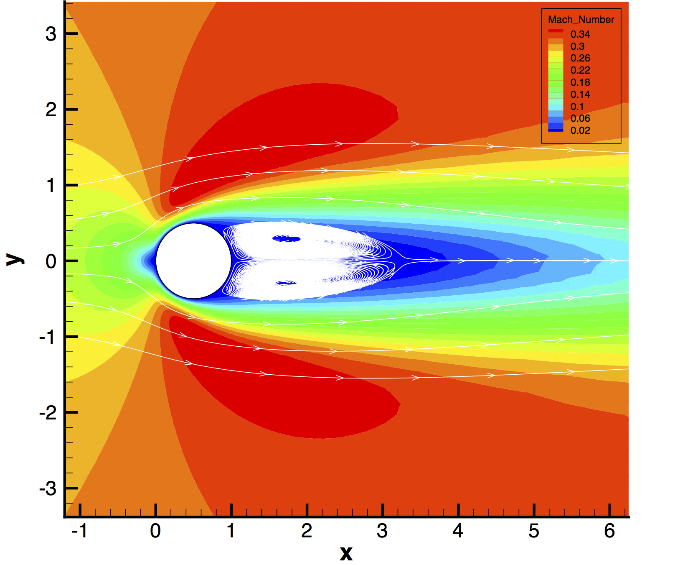
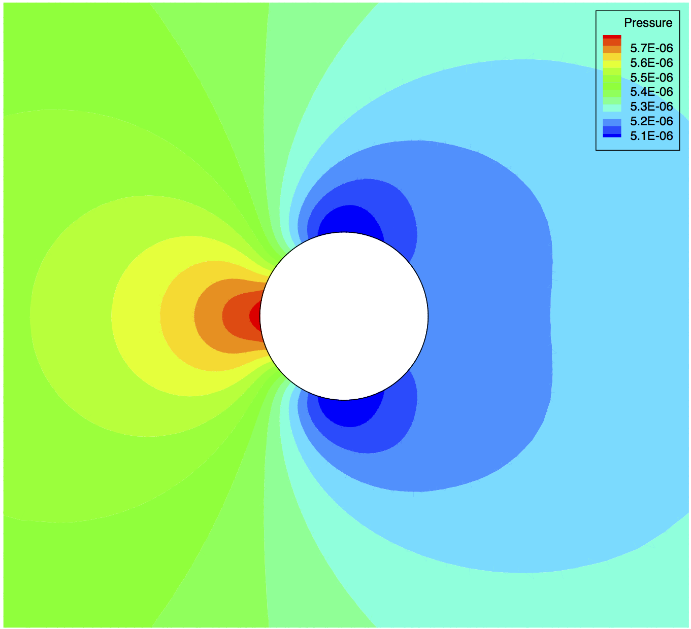

Laminar Cylinder
=====



## Goals

Upon completing this tutorial, the user will be familiar with performing a simulation of external, laminar flow around a 2D geometry. The specific geometry chosen for the tutorial is a cylinder. Consequently, the following capabilities of SU2 will be showcased:
- Steady, 2D Laminar Navier-Stokes equations 
- Multigrid
- Roe (Second-order) numerical scheme in space
- Euler implicit time integration
- Navier-Stokes wall and far-field boundary conditions
In this tutorial, we discuss some numerical method options, including how to activate a slope limiter for upwind methods.

## Resources

The resources for this tutorial can be found in the TestCases/navierstokes/cylinder directory. You will need the configuration file (lam_cylinder.cfg) and the mesh file (mesh_cylinder_lam.su2).

Experimental results for drag over a cylinder at low Reynolds numbers are reported in the following article:
D. J. Tritton, "Experiments on the flow past a circular cylinder at low Reynolds numbers," Journal of Fluid Mechanics, Vol. 6, No. 4, pp. 547-567, 1959. 

## Tutorial

The following tutorial will walk you through the steps required when solving for the flow around a cylinder using SU2. It is assumed you have already obtained and compiled the SU2_CFD code for a serial computation. If you have yet to complete these requirements, please see the Download and Installation pages.

### Background

The flow around a two-dimensional circular cylinder is a case that has been used both for validation purposes and as a legitimate research case. At very low Reynolds numbers of less than about 46, the flow is steady and symmetric. As the Reynolds number is increased, asymmetries and time-dependence develop, eventually resulting in the Von Karmann vortex street, and then on to turbulence.

### Problem Setup

This problem will solve the for the external flow over the cylinder with these conditions:
- Freestream temperature = 273.15 K
- Freestream Mach number = 0.1
- Angle of attack (AOA) = 0.0 degrees
- Reynolds number = 40 for a cylinder radius of 1 m 

### Mesh Description

The problem geometry is two-dimensional. The mesh has 26,192 triangular elements. It is fine near the surface of the cylinder to resolve the boundary layer. The exterior boundary is approximately 15 diameters away from the cylinder surface to avoid interaction between the boundary conditions. Far-field boundary conditions are used at the outer boundary. No-slip boundary conditions are placed on the surface of the cylinder. 


Figure (1): The computational mesh for the 2D cylinder test case. 

The outer boundary in red is the far-field, and the small circle in the center is the cylinder which uses the Navier-Stokes Wall boundary condition.

### Configuration File Options

Several of the key configuration file options for this simulation are highlighted here. We again highlight some options concerning numerics for a viscous flow of this nature:
```
% Convective numerical method (JST, LAX-FRIEDRICH, CUSP, ROE, AUSM, HLLC,
%                              TURKEL_PREC, MSW)
CONV_NUM_METHOD_FLOW= ROE
%
% Spatial numerical order integration (1ST_ORDER, 2ND_ORDER, 2ND_ORDER_LIMITER)
%
SPATIAL_ORDER_FLOW= 2ND_ORDER_LIMITER
%
% Slope limiter (VENKATAKRISHNAN, MINMOD)
SLOPE_LIMITER_FLOW= VENKATAKRISHNAN
%
% Coefficient for the limiter (smooth regions)
LIMITER_COEFF= 100.0
```
For laminar flow around the cylinder, the 2nd-order Roe upwinding method showed good performance when the Venkatakrishnan limiter was used. Without the limiter, the computation is much less stable and may not converge. Note that, in order to activate the limiter for the upwind methods, 2ND_ORDER_LIMITER must be selected for the SPATIAL_ORDER_FLOW option. If 2ND_ORDER is chosen, no limiting will be applied to the convective flux during the higher-order reconstruction. Limiting is not applicable for 1ST_ORDER, as there is no higher-order reconstruction and thus no need to limit the gradients. The viscous terms are computed with the corrected average of gradients method (by default). As in the flat plate tutorial, it is recommended that users experiment with the LIMITER_COEFF value for their own applications.

### Running SU2

The cylinder simulation for the 13,336 node mesh is small and will execute relatively quickly on a single workstation or laptop in serial. To run this test case, follow these steps at a terminal command line:
 1. Move to the directory containing the configuration file (lam_cylinder.cfg) and the mesh file (mesh_cylinder_lam.su2). Make sure that the SU2 tools were compiled, installed, and that their install location was added to your path.
 2. Run the executable by entering "SU2_CFD lam_cylinder.cfg" at the command line.
 3. SU2 will print residual updates with each iteration of the flow solver, and the simulation will terminate after meeting the specified convergence criteria.
 4. Files containing the results will be written upon exiting SU2. The flow solution can be visualized in ParaView (.vtk) or Tecplot (.dat for ASCII).

### Results

The following results show the flow around the cylinder as calculated by SU2 (note that these were for a slightly higher Mach number of 0.3).


Figure (2): Pressure contours around the cylinder.


Figure (3): Laminar viscosity contours for this steady, low Reynolds number flow.


Figure (4): Mach number contours around the cylinder with streamlines. Note the large laminar separation region behind the cylinder at Re = 40.
