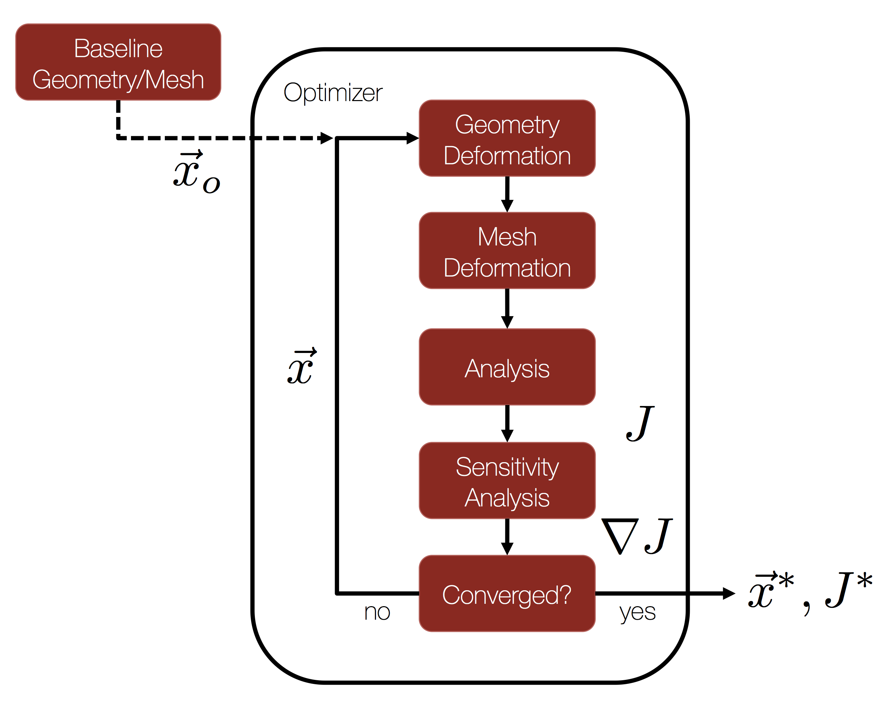

Optimal Shape Design of a Transonic Airfoil
======



## Goals

For this tutorial, we return to the classic NACA 0012 test case that was the subject of the [[Quick Start]] and perform aerodynamic design. Upon completing this tutorial, the user will be familiar with performing an optimal shape design of a 2D geometry. The initial geometry chosen for the tutorial is the NACA 0012 airfoil in transonic, inviscid flow. This tutorial is mean to be an introduction for using the components of SU2 for shape design in the context of a simple, unconstrained optimization problem. Consequently, the following SU2 tools will be showcased in this tutorial:
- **SU2_CFD** - performs the direct and the adjoint flow simulations
- **SU2_DOT** - projects the adjoint surface sensitivities into the design space to obtain the gradient
- **SU2_DEF** - deforms the geometry and mesh with changes in the design variables during the shape optimization process
- **shape_optimization.py** - automates the entire shape design process by executing the SU2 tools and optimizer

We will walk through the shape design process and highlight several options related to the continuous adjoint in SU2 and the configuration options for shape design.

## Resources

The resources for this tutorial can be found in the TestCases/optimization_euler/steady_naca0012/ directory. You will need the configuration file (inv_NACA0012_basic.cfg) and the mesh file (mesh_NACA0012_inv.su2). Restart files for the flow and adjoint problems are also available in this directory, which can be used as an initial state for reducing the cost of the design process.

## Tutorial

The following tutorial will walk you through the steps required when performing shape design for the transonic airfoil using SU2. It is assumed that you have already obtained and compiled SU2_CFD, SU2_DOT, and SU2_DEF. The design loop is driven by the shape_optimization.py script, and thus Python along with the NumPy and SciPy Python modules are required for this tutorial. If you have yet to complete these requirements, please see the [[Download]] and [[Installation]] pages. It may also be helpful to review the [[Quick Start]] tutorial to refamiliarize yourself with this problem.

### Background

This example uses a 2D airfoil geometry (initially the NACA 0012) in transonic inviscid flow. See the [[Quick Start]] for more information on the baseline geometry. 

The general process for performing gradient-based shape optimization with SU2 is given in the flow chart at the top of the page. We start with a baseline geometry and grid as input to our design cycle, along with a chosen objective function (J) and set of design variables (x). For this tutorial, we will use the NACA 0012 and the unstructured mesh from the [[Quick Start]] as our inputs with drag as our chosen objective and a set of Hicks-Henne bump functions to parameterize the shape. 

From there, everything needed for automatic shape design is provided for you in the SU2 framework! By launching the shape_optimization.py script (described below), a gradient-based optimizer will orchestrate the design cycle consisting of the flow solver, adjoint solver, and geometry/mesh deformation tools available in SU2. This iterative design loop will proceed until a minimum is found or until reaching a maximum number of optimizer iterations. Many useful output files will be available to you at the conclusion.

### Problem Setup

The flow conditions of this numerical experiment are such that transonic shocks appear on the upper and lower surfaces, which causes drag. The goal of the design process is to minimize the coefficient of drag (Cd) by changing the shape of the airfoil. In other words, we would like to eliminate the shocks along the airfoil surface. This problem will solve the Euler and adjoint Euler (drag objective) equations on the NACA0012 airfoil at an angle of attack of 1.25 degrees using air with the following freestream conditions:

- Pressure = 101325 Pa
- Temperature = 273.15 K
- Mach number = 0.8

While more advanced design problems can be selected, such as those containing flow and/or geoemtric constraints, we will consider a simple unconstrained drag minimization problem here to get started.

### Mesh Description

The mesh consists of a far-field boundary and an Euler wall (flow tangency) along the airfoil surface. The mesh can be seen in Figure (2).


Figure (2): Far-field and zoom view of the initial computational mesh.

### Configuration File Options

Several of the key configuration file options for this simulation are highlighted here. First, we note that we are choosing a drag objective with the first config option below. A number of objective functions are implemented in SU2, and we recommend that you check the config_template.cfg file in the root directory for a list of those that are available.

Next, we will discuss the common parameters needed for running an adjoint simulation. The continuous adjoint implementation in SU2 enables one to leverage many of the numerical methods found in the flow solver (often called the 'primal' or 'direct' solution). The continuous adjoint PDE is solved on the same numerical grid with very similar time integration techniques (implicit integration here). This allows for a very efficient adjoint approach with minimal overhead in terms of memory and compute.

```
% ---------------- ADJOINT-FLOW NUMERICAL METHOD DEFINITION -------------------%
% Adjoint problem boundary condition (DRAG, LIFT, SIDEFORCE, MOMENT_X,
%                                     MOMENT_Y, MOMENT_Z, EFFICIENCY,
%                                     EQUIVALENT_AREA, NEARFIELD_PRESSURE,
%                                     FORCE_X, FORCE_Y, FORCE_Z, THRUST,
%                                     TORQUE, FREE_SURFACE)
OBJECTIVE_FUNCTION= DRAG
%
% Convective numerical method (JST, LAX-FRIEDRICH, ROE-1ST_ORDER,
%                              ROE-2ND_ORDER)
CONV_NUM_METHOD_ADJFLOW= JST
%
% Slope limiter (VENKATAKRISHNAN, SHARP_EDGES)
SLOPE_LIMITER_ADJFLOW= VENKATAKRISHNAN
%
% 1st, 2nd, and 4th order artificial dissipation coefficients
AD_COEFF_ADJFLOW= ( 0.15, 0.0, 0.02 )
%
% Time discretization (RUNGE-KUTTA_EXPLICIT, EULER_IMPLICIT)
TIME_DISCRE_ADJFLOW= EULER_IMPLICIT
%
% Reduction factor of the CFL coefficient in the adjoint problem
CFL_REDUCTION_ADJFLOW= 0.8
%
% Limit value for the adjoint variable
LIMIT_ADJFLOW= 1E6
```
For this inviscid case, we have selected a modified version of the JST scheme for spatial integration. This 2nd-order, centered scheme affords us control over the level of dissipation applied to the problem. In particular, we control the higher-order dissipation (added everywhere in the solution) by modifying the 3rd entry in the AD_COEFF_ADJFLOW option. 

If you are having trouble converging your adjoint calculation, we often recommend adjusting the level of dissipation, along with reducing the CFL condition with the CFL_REDUCTION_ADJFLOW option, or even imposing a hard limit on the value of the adjoint density variable using the LIMIT_ADJFLOW option. While increasing the dissipation or limiting the adjoint variables can sometimes help to stabilize a solution, **note that overly increasing the dissipation or imposing limits that are too strict can result in decreased accuracy**. One should fully investigate the effect of these parameters, and ideally, a gradient accuracy/verification study should be performed (one can always compare against finite differencing).

Now, we present the options that specify the optimal shape design problem:
```
% --------------------- OPTIMAL SHAPE DESIGN DEFINITION -----------------------%
%
% Optimization objective function with scaling factor
% ex= Objective * Scale
OPT_OBJECTIVE= DRAG * 0.001
%
% Optimization constraint functions with scaling factors, separated by semicolons
% ex= (Objective = Value ) * Scale, use '>','<','='
OPT_CONSTRAINT= NONE
%
% Maximum number of optimizer iterations
OPT_ITERATIONS= 100
%
% Requested accuracy
OPT_ACCURACY= 1E-6
%
% Upper bound for each design variable
OPT_BOUND_UPPER= 0.1
%
% Lower bound for each design variable
OPT_BOUND_LOWER= -0.1
%
% Optimization design variables, separated by semicolons
DEFINITION_DV= ( 1, 1.0 | airfoil | 0, 0.05 ); ( 1, 1.0 | airfoil | 0, 0.10 ); ( 1, 1.0 | airfoil | 0, 0.15 ); ( 1, 1.0 | airfoil | 0, 0.20 ); ( 1, 1.0 | airfoil | 0, 0.25 ); ( 1, 1.0 | airfoil | 0, 0.30 ); ( 1, 1.0 | airfoil | 0, 0.35 ); ( 1, 1.0 | airfoil | 0, 0.40 ); ( 1, 1.0 | airfoil | 0, 0.45 ); ( 1, 1.0 | airfoil | 0, 0.50 ); ( 1, 1.0 | airfoil | 0, 0.55 ); ( 1, 1.0 | airfoil | 0, 0.60 ); ( 1, 1.0 | airfoil | 0, 0.65 ); ( 1, 1.0 | airfoil | 0, 0.70 ); ( 1, 1.0 | airfoil | 0, 0.75 ); ( 1, 1.0 | airfoil | 0, 0.80 ); ( 1, 1.0 | airfoil | 0, 0.85 ); ( 1, 1.0 | airfoil | 0, 0.90 ); ( 1, 1.0 | airfoil | 0, 0.95 ); ( 1, 1.0 | airfoil | 1, 0.05 ); ( 1, 1.0 | airfoil | 1, 0.10 ); ( 1, 1.0 | airfoil | 1, 0.15 ); ( 1, 1.0 | airfoil | 1, 0.20 ); ( 1, 1.0 | airfoil | 1, 0.25 ); ( 1, 1.0 | airfoil | 1, 0.30 ); ( 1, 1.0 | airfoil | 1, 0.35 ); ( 1, 1.0 | airfoil | 1, 0.40 ); ( 1, 1.0 | airfoil | 1, 0.45 ); ( 1, 1.0 | airfoil | 1, 0.50 ); ( 1, 1.0 | airfoil | 1, 0.55 ); ( 1, 1.0 | airfoil | 1, 0.60 ); ( 1, 1.0 | airfoil | 1, 0.65 ); ( 1, 1.0 | airfoil | 1, 0.70 ); ( 1, 1.0 | airfoil | 1, 0.75 ); ( 1, 1.0 | airfoil | 1, 0.80 ); ( 1, 1.0 | airfoil | 1, 0.85 ); ( 1, 1.0 | airfoil | 1, 0.90 ); ( 1, 1.0 | airfoil | 1, 0.95 )
```
Here, we define the objective function for the optimization as drag without any constraints. The scale value of 0.001 is chosen to aid the optimizer in taking a physically appropriate first step (i.e., not too large that the subsequent calculations go unstable due to a large, non-physical deformation). We could impose a constraint on the maximum thickness, for instance, or add a lift constraint. Constraints will be discussed in the next tutorial on 3D design.

The SLSQP optimizer from the SciPy package for Python is the default optimizer called by the shape_optimization.py script. In addition to the hooks to the objective and gradient functions, this optimizer accepts options for the maximum number of optimizer iterations (OPT_ITERATIONS), requested accuracy (OPT_ACCURACY), and design variable bounds (OPT_BOUND_UPPER, OPT_BOUND_LOWER). During the optimization process, the SLSQP optimizer will call the flow and adjoint problems as necessary to take the next step in the design space. However, note that the optimizer will often make multiple function calls per major optimizer iteration in order to compute the next step size.

The DEFINITION_DV is the list of design variables. For the airfoil problem, we want to minimize the drag by changing the surface profile shape. To do so, we define a set of Hicks-Henne bump functions. Each design variable is separated by a semicolon, although **note that there is no final semicolon at the end of the list**. 

The first value in the parentheses is the variable type, which is 1 for a Hicks-Henne bump function. The second value is the scale of the variable (typically left as 1.0). The name between the vertical bars is the marker tag where the variable deformations will be applied. Only the airfoil surface will be deformed in this problem. The final two values in the parentheses specify whether the bump function is applied to the upper (1) or lower (0) side and the x-location of the bump between 0 and 1 (we assume a chord of 1.0 for the Hicks-Henne bumps), respectively. 

Note that there are many other types of design variables available in SU2, and each has their own specific input format. 3D design variables based on the free-form deformation approach (FFD) will be discussed in the next tutorial.


Figure (3): Pressure contours for the baseline NACA 0012 airfoil.

### Running SU2

The continuous adjoint methodology for obtaining surface sensitivities is implemented for several equation sets within SU2. After solving the direct flow problem, the adjoint problem is also solved which offers an efficient approach for calculating the gradient of an objective function with respect to a large set of design variables. This leads directly to a gradient-based optimization framework. With each design iteration, the direct and adjoint solutions are used to compute the objective function and gradient, and the optimizer drives the shape changes with this information in order to minimize the objective. Two other SU2 tools are used to compute the gradient from the adjoint solution (SU2_DOT) and deform the computational mesh (SU2_DEF) during the process.


Figure (4): Adjoint density contours on the baseline NACA 0012 airfoil.

To run this design case, follow these steps at a terminal command line:
1. Move to the directory containing the config file (inv_NACA0012_basic.cfg) and the mesh file (mesh_NACA0012_inv.su2). Assuming that SU2 tools were compiled, installed, and that their install location was added to your path, the shape_optimization.py script, SU2_CFD, SU2_DOT, and SU2_DEF should all be available.

2. Execute the shape optimization script by entering `$ python shape_optimization.py -f inv_NACA0012_basic.cfg' at the command line. Again, note that Python, NumPy, and SciPy are all required to run the script.

3. The python script will drive the optimization process by executing flow solutions, adjoint solutions, gradient projection, and mesh deformation in order to drive the design toward an optimum. The optimization process will cease when certain tolerances set within the SciPy optimizer are met.

4. Solution files containing the flow and surface data will be written for each flow solution and adjoint solution and can be found in the DESIGNS directory that is created. The flow solutions are in the DESIGNS/DSN_*/DIRECT/ directories. The file named history_project.dat (or history_project.csv for ParaView) will contain the functional values of interest resulting from each evaluation during the optimization.

### Results for the optimal shape design problem:


Figure (5): Pressure contours around the final airfoil design. Note the nearly shock-free final design.


Figure (6): Cp distribution and profile shape comparison for the initial and final airfoil designs.


Figure (7): Function evaluation history during the optimization process.
