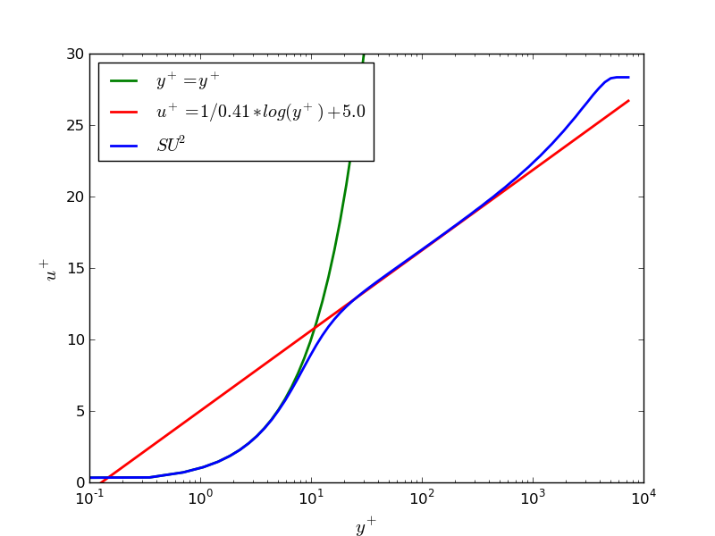

Turbulent Flat Plate
=====




## Goals

Upon completing this tutorial, the user will be familiar with performing a simulation of external, turbulent flow over a flat plate. Consequently, the following capabilities of SU2 will be verified against other codes and validated against theoretical results in this tutorial:
- Steady, 2D RANS Navier-Stokes equations 
- Spalart-Allmaras turbulence model
- Roe 2nd-order numerical scheme in space
- Euler implicit time integration
- Inlet, Outlet, and Navier-Stokes Wall boundary conditions

In this tutorial, we perform our first RANS simulation with the Spalart-Allmaras (SA) turbulence model.

## Resources

The resources for this tutorial can be found in the Tutorials/Turbulent_Flat_Plate directory. You will need the configuration file (turb_SA_flatplate.cfg) and either of the two available mesh files (mesh_flatplate_turb_137x97.su2 or mesh_flatplate_turb_545x385.su2). The configuration file can be found in the SU2 repository whereas the mesh files can be found in the Tutorials repository.

Additionally, skin friction and velocity profiles corresponding to this testcase (obtained from the Langley Research Center Turbulence Modeling Resource website shown below) are used for later comparison with SU2 results. These files can be found on the following website: http://turbmodels.larc.nasa.gov/flatplate.html.

## Tutorial

The following tutorial will walk you through the steps required when solving for the turbulent flow over a flat plate using SU2. It is assumed you have already obtained and compiled the SU2_CFD code for a serial computation or both the SU2_CFD and SU2_SOL codes for a parallel computation. If you have yet to complete these requirements, please see the Download and Installation pages.

### Background

Turbulent flow over a zero pressure gradient flat plate is a common test case for the verification and validation of turbulence models in CFD solvers. The flow is everywhere turbulent and a boundary layer develops over the surface of the flat plate. The lack of separation bubbles or other more complex flow phenomena allows turbulence models to predict the flow with a high level of accuracy. Due to the choice of a low Mach number of 0.2 for this case, compressibility effects are essentially negligible. 

For verification, we will be comparing SU2 results against those from the NASA codes FUN3D and CFL3D. For validation purposes we will compare profiles of u+ vs. y+ against theoretical profiles of the viscous sublayer and log law region.  

### Problem Setup

The length of the flat plate is 2 meters, and it is represented by an adiabatic no-slip wall boundary condition. Also part of the domain is a symmetry plane located before the leading edge of the flat plate. Inlet and outlet boundary conditions are used on the left and right boundaries of the domain, and an outlet boundary condition is used over the top region of the domain, which is located 1 meter away from the flat plate. The Reynolds number based on a length of 1 meter is 5 million, and the Mach number is 0.2. 

### Mesh Description

The mesh used for this tutorial, which consists of 13,056 rectangular elements, is shown below.


Figure (1): Mesh with boundary conditions (inlet, outlet, symmetry, wall).

### Configuration File Options

Several of the key configuration file options for this simulation are highlighted here. For the first time in the tutorials, we will use a turbulence model:
```
% Physical governing equations (EULER, NAVIER_STOKES,
%                               WAVE_EQUATION, HEAT_EQUATION, LINEAR_ELASTICITY,
%                               POISSON_EQUATION)
PHYSICAL_PROBLEM= NAVIER_STOKES
%
% If Navier-Stokes, kind of turbulent model (NONE, SA, SST)
KIND_TURB_MODEL= SA
```
The governing equations are Navier-Stokes, but by entering "SA" as the option for "KIND_TURB_MODEL," we activate the RANS governing equations with the Spalart-Allmaras (SA) turbulence model. The SA model is composed of one-equation for a turbulence field variable that is directly related to the turbulent eddy viscosity. It is a popular choice for external aerodynamic flows, such as those around airfoils and wings. In previous tutorials, "NONE" has been chosen, resulting in the use of the laminar Navier-Stokes governing equations. The Shear Stress Transport model (SST) of Menter is also available in SU2.

### Running SU2

To run this test case, follow these steps at a terminal command line:
 1. Copy the config file (turb_SA_flatplate.cfg) and/or the mesh file (mesh_flatplate_turb_137x97.su2) so that they are in the same directory. Move to the directory containing the config file and the mesh file. Make sure that the SU2 tools were compiled, installed, and that their install location was added to your path.
 2. Run the executable by entering "SU2_CFD turb_SA_flatplate.cfg" at the command line.
 3. SU2 will print residual updates with each iteration of the flow solver, and the simulation will finish upon reaching the specified convergence criteria.
 4. Files containing the results will be written upon exiting SU2. The flow solution can be visualized in ParaView (.vtk) or Tecplot (.dat for ASCII).

### Results

The figures below show results obtained from SU2 and compared to several results from NASA codes. Note that the SU2 results for the skin friction correspond to the coarser mesh (mesh_flatplate_turb_137x97.su2) while the NASA results are based on the finer mesh (mesh_flatplate_turb_545x385.su2). SU2 still matches very closely.


Figure (2): Contour of turbulence variable (nu-hat).


Figure (3): Profile for the skin friction coefficient. 


Figure (4): Velocity profile comparison against law of the wall.
