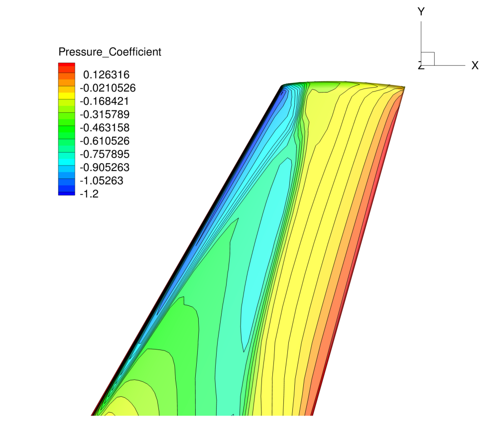

Turbulent ONERA M6
======



## Goals

Upon completing this tutorial, the user will be familiar with performing a simulation of external, viscous flow around a 3D geometry using a turbulence model. The specific geometry chosen for the tutorial is the classic ONERA M6 wing. Consequently, the following capabilities of SU2 will be showcased in this tutorial:
- Steady, 3D RANS equations 
- Spalart-Allmaras turbulence model
- Roe 2nd-order numerical scheme in space
- Euler implicit time integration
- Navier-Stokes Wall, Symmetry, and Far-field boundary conditions
- Code parallelism (optional)

This tutorial also provides an explanation for properly setting up viscous, 3D flow conditions in SU2.

## Resources

The resources for this tutorial can be found in the Tutorials/Turbulent_OneraM6 directory. You will need the configuration file (turb_ONERAM6.cfg) and the mesh file (mesh_ONERAM6_turb_hexa_43008.su2).

## Tutorial

The following tutorial will walk you through the steps required when solving for the flow around the ONERA M6 using SU2. The tutorial will also address procedures for both serial and parallel computations. To this end, it is assumed you have already obtained and compiled the SU2_CFD. If you have yet to complete these requirements, please see the Download and Installation pages.

### Background

This test case is for the ONERA M6 wing in viscous flow. The ONERA M6 wing was designed in 1972 by the ONERA Aerodynamics Department as an experimental geometry for studying three-dimensional, high Reynolds number flows with some complex flow phenomena (transonic shocks, shock-boundary layer interaction, separated flow). It has become a classic validation case for CFD codes due to the simple geometry, complicated flow physics, and availability of experimental data. This particular study will be performed at a transonic Mach number with the 3D RANS equations in SU2.

### Problem Setup

This problem will solve the flow past the wing with these conditions:
- Freestream Temperature = 288.15 K
- Freestream Mach number = 0.8395
- Angle of attack (AOA) = 3.06 deg
- Reynolds number = 11.72E6
- Reynolds length = 0.64607 m

These transonic flow conditions will cause the typical "lambda" shock along the upper surface of the lifting wing.

### Mesh Description

The computational domain is a large C-type mesh with the wing half-span on one boundary in the x-z plane. The mesh consists of 43,008 interior elements and 46,417 nodes. Three boundary conditions are employed: the Navier-Stokes adiabatic wall condition on the wing surface, the far-field characteristic-based condition on the far-field markers, and a symmetry boundary condition for the marker where the wing half-span is attached. The symmetry condition acts to mirror the flow about the x-z plane, reducing the size of the mesh and the computational cost. Images of the entire domain and the structured, rectangular elements on the wing surface are shown below.


Figure (1): Far-field view of the computational mesh.


Figure (2): Close-up view of the structured surface mesh on the upper wing surface.

### Configuration File Options

Several of the key configuration file options for this simulation are highlighted here. We now discuss the proper way to prescribe 3D, viscous flow conditions in SU2:

```
% -------------------- COMPRESSIBLE FREE-STREAM DEFINITION --------------------%
%
% Mach number (non-dimensional, based on the free-stream values)
MACH_NUMBER= 0.8395
%
% Angle of attack (degrees, only for compressible flows)
AOA= 3.06
%
% Side-slip angle (degrees, only for compressible flows)
SIDESLIP_ANGLE= 0.0
%
% Free-stream temperature (288.15 K by default)
FREESTREAM_TEMPERATURE= 288.15
%
% Reynolds number (non-dimensional, based on the free-stream values)
REYNOLDS_NUMBER= 11.72E6
%
% Reynolds length (1 m by default)
REYNOLDS_LENGTH= 0.64607

% ---- IDEAL GAS, POLYTROPIC, VAN DER WAALS AND PENG ROBINSON CONSTANTS -------%
%
% Different gas model (STANDARD_AIR, IDEAL_GAS, VW_GAS, PR_GAS)
FLUID_MODEL= STANDARD_AIR
%
% Ratio of specific heats (1.4 default and the value is hardcoded
%                          for the model STANDARD_AIR)
GAMMA_VALUE= 1.4
%
% Specific gas constant (287.058 J/kg*K default and this value is hardcoded 
%                        for the model STANDARD_AIR)
GAS_CONSTANT= 287.058
%
% Critical Temperature (131.00 K by default)
CRITICAL_TEMPERATURE= 131.00
%
% Critical Pressure (3588550.0 N/m^2 by default)
CRITICAL_PRESSURE= 3588550.0
%
% Critical Density (263.0 Kg/m3 by default)
CRITICAL_DENSITY= 263.0
%
% Acentric factor (0.035 (air))
ACENTRIC_FACTOR= 0.035

% --------------------------- VISCOSITY MODEL ---------------------------------%
%
% Viscosity model (SUTHERLAND, CONSTANT_VISCOSITY).
VISCOSITY_MODEL= SUTHERLAND
%
% Molecular Viscosity that would be constant (1.716E-5 by default)
MU_CONSTANT= 1.716E-5
%
% Sutherland Viscosity Ref (1.716E-5 default value for AIR SI)
MU_REF= 1.716E-5
%
% Sutherland Temperature Ref (273.15 K default value for AIR SI)
MU_T_REF= 273.15
%
% Sutherland constant (110.4 default value for AIR SI)
SUTHERLAND_CONSTANT= 110.4
```
The options above set the conditions for a 3D, viscous flow. The MACH_NUMBER, AOA, and SIDESLIP_ANGLE options remain the same as they appeared for the inviscid ONERA M6 tutorial, which includes a description of the freestream flow direction. For the RANS equations, SU2 is using a calorically perfect gas which is selected by setting the FLUID_MODEL to STANDARD_AIR. The fluid flow properties can be changed by selecting a different fluid model.

For a viscous simulation, the numerical experiment must match the physical reality. This flow similarity is achieved by matching the REYNOLDS_NUMBER and REYNOLDS_LENGTH to the original system (assuming the Mach number and the geometry already match). Upon starting a viscous simulation in SU2, the following steps are performed to set the flow conditions internally:
 1. Use the gas constants and freestream temperature to calculate the speed of sound.
 2. Calculate the freestream velocity vector from the Mach number, AOA/sideslip angle, and speed of sound from step 1.
 3. Compute the freestream viscosity by using the viscosity model specified in the config file.
 4. Use the definition of the Reynolds number to find the freestream density from the supplied Reynolds information, freestream velocity, and freestream viscosity from step 3.
 5. Calculate the freestream pressure using the perfect gas law with the freestream temperature, specific gas constant, and freestream density from step 4.
Notice that the freestream pressure supplied in the configuration file will be ignored for viscous computations. 

Lastly, it is important to note that this method for setting similar flow conditions requires that all inputs are in SI units, including the mesh geometry.

### Running SU2

Instructions for running this test case are given here for both serial and parallel computations.

#### In Serial

The wing mesh should easily fit on a single core machine. To run this test case, follow these steps at a terminal command line:
 1. Move to the directory containing the config file (turb_ONERAM6.cfg) and the mesh file (mesh_ONERAM6_turb_hexa_43008.su2). Make sure that the SU2 tools were compiled, installed, and that their install location was added to your path.
 2. Run the executable by entering in the command line:
      
    ```
    $ SU2_CFD turb_ONERAM6.cfg
    ```

 3. SU2 will print residual updates with each iteration of the flow solver, and the simulation will terminate after reaching the specified convergence criteria.
 4. Files containing the results will be written upon exiting SU2. The flow solution can be visualized in ParaView (.vtk) or Tecplot (.dat for ASCII).

#### In Parallel

If SU2 has been built with parallel support, the recommended method for running a parallel simulation is through the use of the parallel_computation.py Python script. This automatically handles the domain decomposition and execution with SU2_CFD, and the merging of the decomposed files using SU2_SOL. Follow these steps to run the ONERA M6 case in parallel:
 1. Move to the directory containing the config file (turb_ONERAM6.cfg) and the mesh file (mesh_ONERAM6_turb_hexa_43008.su2). Make sure that the SU2 tools were compiled with parallel support, installed, and that their install location was added to your path.
 2. Run the python script which will automatically call SU2_CFD and will perform the simulation using NP number of processors by entering in the command line:

    ```
    $ parallel_computation.py -n NP -f turb_ONERAM6.cfg
    ```

 3. SU2 will print residual updates with each iteration of the flow solver, and the simulation will terminate after reaching the specified convergence criteria.
 4. The python script will automatically call the SU2_SOL executable for merging the decomposed solution files from each processor into a single file. These files containing the results will be written upon exiting SU2. The flow solution can then be visualized in ParaView (.vtk) or Tecplot (.dat for ASCII).

### Results

Results for the turbulent flow over the ONERA M6 wing are shown below. As part of this tutorial a coarse mesh has been provided, but for comparison the results obtained by using a refined mesh (9,252,922 nodes) as well as experimental results are shown.


Figure (3): Comparison of Cp profiles of the experimental results of Schmitt and Carpin (red squares) against SU2 computational results (blue line) at different sections along the span of the wing. (a) y/b = 0.2, (b) y/b = 0.65, (c) y/b = 0.8, (d) y/b = 0.95.
